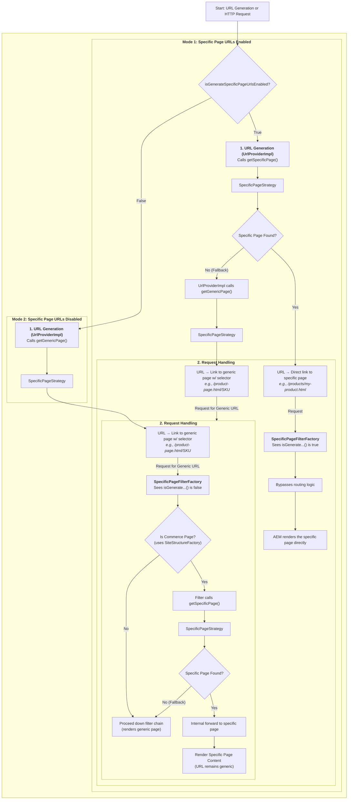

# Dynamic Page Routing in AEM CIF Components

> [!NOTE]
> This document pertains to version `2.17.4` of the AEM CIF Core Components. The concepts described here are based on the state of the codebase at this version.

This document provides an extensive explanation of the dynamic page routing logic within the Adobe Experience Manager (AEM) CIF (Commerce Integration Framework) Core Components, focusing on how product and category pages are resolved and rendered. This mechanism exists to let AEM deliver commerce pages at scale without generating or managing one AEM page per product or category, while still keeping strong authoring, performance, and SEO characteristics.

**Key Benefits of Dynamic Page Routing:**

*   **Scale and Operational Efficiency:** Dynamic routing enables AEM to handle vast commerce catalogs (tens or hundreds of thousands of SKUs) with a minimal set of generic Product Detail Page (PDP) and Product Listing Page (PLP) templates. This drastically reduces repository size, authoring overhead, and rollout complexity, making large-scale commerce operations manageable.
*   **Separation of Concerns and Agility:** CIF ensures AEM focuses on content and experience, while the commerce engine remains the authoritative source for product data (prices, inventory, catalog structure). Dynamic routing maintains this separation by resolving URLs to commerce entities on demand via GraphQL. This means catalog changes are immediately reflected without requiring AEM page structure modifications, fostering agility.
*   **Time-to-Market and Reduced Custom Code:** As a core part of the CIF add-on's standardization efforts, dynamic routing minimizes the need for custom integration code between AEM and commerce platforms like Adobe Commerce. Teams can launch commerce sites more quickly, dedicating their development efforts to unique user experiences, personalization, or specific business logic rather than boilerplate URL-SKU wiring.
*   **Authoring Flexibility and Experience Consistency:** Marketers benefit from rich AEM templates featuring content slots for banners, editorial content, and fragments. These templates are consistently reused across the entire catalog, ensuring a uniform layout and behavior. The generic nature of routing also simplifies support for multiple brands, locales, or channels from a single component set, leading to consistent experiences and easier global governance.
*   **Performance, Caching, and SEO:** By serving many products from a compact set of AEM resources, dynamic routing streamlines dispatcher and CDN caching rules, keeping the page layer lightweight. Commerce data is fetched on demand and can be efficiently cached at the edge or commerce tier. Furthermore, it supports SEO-friendly URL schemes (e.g., category-rich paths, readable product keys) without proliferating physical AEM pages, allowing for both flexible URL strategies and manageable operations.

The core components involved are [`SpecificPageFilterFactory.java`](https://github.com/adobe/aem-core-cif-components/tree/core-cif-components-reactor-2.17.4/bundles/core/src/main/java/com/adobe/cq/commerce/core/components/internal/servlets/SpecificPageFilterFactory.java) and [`SpecificPageStrategy.java`](https://github.com/adobe/aem-core-cif-components/tree/core-cif-components-reactor-2.17.4/bundles/core/src/main/java/com/adobe/cq/commerce/core/components/internal/services/SpecificPageStrategy.java).

## 0. Understanding 'Specific Pages' and 'Generic Pages'

To fully grasp AEM CIF's dynamic page routing, it's essential to understand the distinction between "specific pages" and "generic pages" in the context of product and category detail views.

*   **Generic Pages (Template Pages):**
    *   These are standard AEM pages that serve as templates or blueprints for rendering a *type* of commerce entity.
    *   For example, you might have a single "Product Detail Page" (`/content/mysite/en/product-page.html`) that is designed to display *any* product's information. Similarly, a "Category Page" (`/content/mysite/en/category-page.html`) would display any category's listing.
    *   These pages contain components configured to fetch and render data dynamically based on commerce identifiers (like product SKUs or category IDs) passed via the URL.
    *   A single generic page can render an infinite number of products or categories.

*   **Specific Pages (Dedicated Pages):**
    *   These are individual AEM pages that are explicitly created and authored for a *particular* product or category.
    *   For example, you could have a page dedicated to a specific product like "My Awesome Product" at `/content/mysite/en/products/my-awesome-product.html`, or a page for "Electronics" category at `/content/mysite/en/categories/electronics.html`.
    *   These pages allow content authors to add unique AEM-managed content (e.g., custom banners, marketing text, embedded videos) directly alongside the commerce data for that specific product or category.
    *   They are typically linked to a specific product or category ID through page properties or other configurations.
    *   Specific pages are often children of a generic page or a specific folder structure designed for them.

The dynamic routing mechanism described in this document enables AEM CIF to effectively manage URLs and content rendering whether you choose to use predominantly generic pages, specific pages, or a hybrid approach.

## 1. Overview of Dynamic Page Routing

In AEM CIF, dynamic page routing allows the platform to serve content for commerce entities (like products and categories) from dedicated AEM pages, even if the incoming URL doesn't directly map to a static AEM resource. This is crucial for SEO-friendly URLs and flexible content management. The system supports two primary modes of operation for URL handling:

1.  **Direct Linking to Specific Pages**: URLs directly point to AEM pages specifically created for a product or category.
2.  **Generic Page with Dynamic Dispatching**: URLs point to a generic AEM template page, and a filter then dynamically forwards the request internally to the correct specific content based on URL parameters.

The choice between these modes is controlled by a configuration toggle.

## 2. [`SpecificPageFilterFactory.java`](https://github.com/adobe/aem-core-cif-components/tree/core-cif-components-reactor-2.17.4/bundles/core/src/main/java/com/adobe/cq/commerce/core/components/internal/servlets/SpecificPageFilterFactory.java)

`SpecificPageFilterFactory` is an OSGi Filter component that intercepts HTTP requests in AEM. It is designed to dynamically route requests for product and category pages.

### Key Functionalities:

*   **Request Filtering:** It is configured to intercept HTTP requests for `cq:Page` resources and specific commerce page resource types (from both v1 and v2 `PageImpl` implementations) with `.html` or `.json` extensions. It's set to run relatively late in the OSGi filter chain (`Constants.SERVICE_RANKING + ":Integer=-5000"`).
*   **Deep Linking Bypass:** A critical aspect of its behavior is its interaction with the `SpecificPageStrategy`. If `specificPageStrategy.isGenerateSpecificPageUrlsEnabled()` returns `true` (meaning direct specific page URLs are enabled), the filter *bypasses* its routing logic.
*   **Commerce Page Identification:** For requests that are not bypassed, the filter determines if the current AEM page is a product or category page using the `SiteStructureFactory`.
*   **Specific Page Resolution:**
    *   For product or category pages, it parses URL parameters (e.g., product SKU, category ID) using [`UrlProviderImpl`](https://github.com/adobe/aem-core-cif-components/tree/core-cif-components-reactor-2.17.4/bundles/core/src/main/java/com/adobe/cq/commerce/core/components/internal/services/UrlProviderImpl.java).
    *   It then uses `SpecificPageStrategy.getSpecificPage()` to find the appropriate AEM content page (the "specific page") that corresponds to these parameters.
*   **Request Forwarding:** If a specific page is found, the original request is internally forwarded to that specific page's content resource using a `RequestDispatcher`. If no specific page is found, the request proceeds down the filter chain without modification, potentially leading to a 404 or rendering of the generic page content.

### Purpose:

The `SpecificPageFilterFactory` acts as a dynamic dispatcher. When "Specific Page URLs Disabled" mode is active, it ensures that incoming generic URLs containing commerce-specific identifiers are correctly resolved and routed internally to their corresponding AEM content pages, providing a seamless user experience while leveraging AEM's content authoring capabilities.

## 3. [`SpecificPageStrategy.java`](https://github.com/adobe/aem-core-cif-components/tree/core-cif-components-reactor-2.17.4/bundles/core/src/main/java/com/adobe/cq/commerce/core/components/internal/services/SpecificPageStrategy.java)

`SpecificPageStrategy` is an OSGi service that provides the core logic for identifying specific and generic commerce-related pages. It is consumed by [`UrlProviderImpl`](https://github.com/adobe/aem-core-cif-components/tree/core-cif-components-reactor-2.17.4/bundles/core/src/main/java/com/adobe/cq/commerce/core/components/internal/services/UrlProviderImpl.java) (for URL generation) and `SpecificPageFilterFactory` (for request routing).

### Key Components:

*   **`@ObjectClassDefinition` and `@Designate`:** The class is configured via OSGi Metatype annotations, allowing for runtime configuration.
*   **`generateSpecificPageUrls` Configuration:** This boolean flag (defaulting to `false`) is the central switch that dictates the URL handling strategy. It's set during the `activate` method based on the OSGi configuration.

### Methods:

*   **`isGenerateSpecificPageUrlsEnabled()`:**
    *   This simple getter method returns the current value of the `generateSpecificPageUrls` configuration.
    *   It serves as a global toggle that determines whether the system should prioritize "specific page URLs" or "generic page URLs."
    *   Its value directly influences the behavior of [`UrlProviderImpl`](https://github.com/adobe/aem-core-cif-components/tree/core-cif-components-reactor-2.17.4/bundles/core/src/main/java/com/adobe/cq/commerce/core/components/internal/services/UrlProviderImpl.java) and `SpecificPageFilterFactory`.

*   **How `getGenericPage` Finds and Filters Pages:**
    *   **Purpose:** To locate the most appropriate *generic template page* that should display a given product or category, especially when specific pages are not used or found. This is the page that serves as a blueprint for a *type* of commerce entity.
    *   **Inputs:** `SiteStructure` (which provides lists of `productPages` and `categoryPages` as `searchRoots`) and commerce parameters (`ProductUrlFormat.Params` or `CategoryUrlFormat.Params`).
    *   **Mechanism:**
        1.  **Iteration through Search Roots:** The method iterates through a predefined list of `SiteStructure.Entry` objects, each representing a potential generic page (`searchRoot`). Each `searchRoot` contains an AEM `Page` and an associated `catalogPage` (which might be the same as the AEM Page or a reference to a catalog root configuration).
        2.  **Filtering Logic:** For each `searchRoot`, it applies a condition: `!isSpecificCatalogPage(searchRoot.getCatalogPage()) || catalogPageCheck.test(searchRoot.getCatalogPage())`.
            *   **`isSpecificCatalogPage(Page catalogPage)`:** This helper method checks if the `catalogPage` (an AEM page configured as a root for a commerce catalog) has the `PN_MAGENTO_ROOT_CATEGORY_IDENTIFIER` and `PN_MAGENTO_ROOT_CATEGORY_IDENTIFIER_TYPE` (set to `"urlPath"`) properties. If these are present, it signifies that this AEM page is configured to represent a specific part of the commerce catalog hierarchy, rather than being a purely generic template.
            *   **`catalogPageCheck.test(searchRoot.getCatalogPage())`:** This is a `Predicate` passed into `getGenericPage` that internally calls `isSpecificCatalogPageFor(catalogPage, params)`. This method verifies if the `catalogPage` (if it is a specific catalog page) *matches* the `urlKey` or `urlPath` extracted from the input product or category `params`.
        3.  **Selection Criteria:**
            *   The method prioritizes truly generic pages, identified when `!isSpecificCatalogPage(searchRoot.getCatalogPage())` is `true`. These are AEM template pages without any specific commerce catalog associations.
            *   If a `searchRoot` *is* configured as a specific catalog page, it's only considered a match if it *also* corresponds to the current commerce context as defined by the input `params` (`catalogPageCheck.test(...)`). This prevents a specific catalog root page from being incorrectly chosen as a generic page for an unrelated commerce entity.
    *   **Output:** The first `Page` in the `searchRoots` list that satisfies these conditions is returned as the generic page.

*   **How `getSpecificPage` Finds and Filters Pages:**
    *   **Purpose:** To locate a *dedicated AEM content page* that has been explicitly configured to display a *particular* product or category, allowing for unique authored content alongside commerce data.
    *   **Inputs:** A starting `Page` (typically a parent page under which specific product/category pages might be organized) and commerce parameters (`ProductUrlFormat.Params` or `CategoryUrlFormat.Params`).
    *   **Mechanism:**
        1.  **Page Traversal:** It first recursively traverses the AEM page hierarchy starting from the provided input `page` using the `traverse` method.
        2.  **Candidate Identification (`isSpecificPage`):** From the traversed pages, it filters candidates using `isSpecificPage(Page candidate)`. A page is considered a "specific page candidate" if its `ValueMap` (page properties) contains either:
            *   `SELECTOR_FILTER_PROPERTY`: This property typically holds specific product SKUs or category identifiers.
            *   `PN_USE_FOR_CATEGORIES`: This property specifically holds category URL paths, indicating the page is meant for a particular category.
            If either of these properties is present and contains values, the page is marked as a potential specific page.
        3.  **Parameter Matching (`isSpecificPageFor`):** The stream of specific page candidates is then further filtered using `isSpecificPageFor(candidate, params)`. This method performs detailed matching based on the type of commerce entity:
            *   **For Products (`isSpecificPageFor(Page candidate, ProductUrlFormat.Params params)`):**
                *   It retrieves configured `productUrlKeys` (SKUs/URL keys) from the page's `SELECTOR_FILTER_PROPERTY`.
                *   It attempts to match these `productUrlKeys` against the `params.getUrlKey()` and `params.getSku()` from the current request.
                *   If the product `params` include category information, it also checks the page's `PN_USE_FOR_CATEGORIES` property against `params.getCategoryUrlParams().getUrlPath()` and `params.getCategoryUrlParams().getUrlKey()`, optionally considering `INCLUDES_SUBCATEGORIES_PROPERTY` for hierarchical matching.
            *   **For Categories (`isSpecificPageFor(Page candidate, CategoryUrlFormat.Params params)`):):**
                *   It retrieves configured `filters` (category UIDs, URL paths, URL keys) from the page's `SELECTOR_FILTER_PROPERTY` (or `PN_USE_FOR_CATEGORIES`).
                *   It considers the `SELECTOR_FILTER_TYPE_PROPERTY` (e.g., `"uidAndUrlPath"`) to correctly parse the filter values.
                *   It attempts to match these filters against `params.getUid()`, `params.getUrlPath()`, and `params.getUrlKey()` from the current request.
                *   The `matchesUrlPath` and `matchesUrlKey` helper methods are used, accounting for exact matches and subcategory inclusion (`INCLUDES_SUBCATEGORIES_PROPERTY`).
    *   **Output:** The first `Page` found that satisfies both being a specific page candidate and matching the provided commerce parameters is returned.

## 4. How `isGenerateSpecificPageUrlsEnabled()` and `getGenericPage` Work Together

The `isGenerateSpecificPageUrlsEnabled()` toggle effectively switches the system between two distinct modes for handling commerce-related URLs:

### Mode 1: Specific Page URLs Enabled (`isGenerateSpecificPageUrlsEnabled() == true`)

In this mode, the system prioritizes direct linking to dedicated AEM pages for products and categories.

*   **URL Generation ([`UrlProviderImpl`](https://github.com/adobe/aem-core-cif-components/tree/core-cif-components-reactor-2.17.4/bundles/core/src/main/java/com/adobe/cq/commerce/core/components/internal/services/UrlProviderImpl.java)):**
    *   The [`UrlProviderImpl`](https://github.com/adobe/aem-core-cif-components/tree/core-cif-components-reactor-2.17.4/bundles/core/src/main/java/com/adobe/cq/commerce/core/components/internal/services/UrlProviderImpl.java) will primarily use methods like `SpecificPageStrategy.getSpecificPage` to find the actual, dedicated AEM content page for a given product or category.
    *   It then generates a URL that directly points to this specific page (e.g., `/content/mysite/en/products/my-specific-product-page.html`).
    *   `SpecificPageStrategy.getGenericPage` might be used as a fallback by [`UrlProviderImpl`](https://github.com/adobe/aem-core-cif-components/tree/core-cif-components-reactor-2.17.4/bundles/core/src/main/java/com/adobe/cq/commerce/core/components/internal/services/UrlProviderImpl.java) if no suitable specific page can be identified for direct linking, meaning a generic URL would be generated in such a case.
*   **Request Handling (`SpecificPageFilterFactory`):**
    *   The `SpecificPageFilterFactory` will check `specificPageStrategy.isGenerateSpecificPageUrlsEnabled()`. Since it's `true`, the filter *bypasses* its dynamic dispatching logic.
    *   The assumption here is that if specific page URLs are enabled, the incoming request URL is already "specific enough" and points directly to the correct content page, or it's a generic request that doesn't need specific handling.

### Mode 2: Specific Page URLs Disabled (`isGenerateSpecificPageUrlsEnabled() == false`)

In this mode, the system relies on generic page templates combined with dynamic dispatching by the filter.

*   **URL Generation ([`UrlProviderImpl`](https://github.com/adobe/aem-core-cif-components/tree/core-cif-components-reactor-2.17.4/bundles/core/src/main/java/com/adobe/cq/commerce/core/components/internal/services/UrlProviderImpl.java)):**
    *   The [`UrlProviderImpl`](https://github.com/adobe/aem-core-cif-components/tree/core-cif-components-reactor-2.17.4/bundles/core/src/main/java/com/adobe/cq/commerce/core/components/internal/services/UrlProviderImpl.java) will use `SpecificPageStrategy.getGenericPage` to determine the appropriate *generic* product or category page template.
    *   It then generates a URL that points to this generic template page, often including product/category identifiers as URL parameters or selectors (e.g., `/content/mysite/en/product-page.html/path/to/product-sku`).
*   **Request Handling (`SpecificPageFilterFactory`):**
    *   The `SpecificPageFilterFactory` will check `specificPageStrategy.isGenerateSpecificPageUrlsEnabled()`. Since it's `false`, the filter *activates* its dynamic dispatching logic.
    *   When a request arrives for a generic URL (e.g., `/content/mysite/en/product-page.html` with product details in the path/parameters), the filter intercepts it.
    *   It then uses logic that internally calls `SpecificPageStrategy.getSpecificPage` (or similar resolution logic) to identify the actual specific AEM content page that should render the requested product or category details.
    *   Finally, it performs an *internal forward* using a `RequestDispatcher` to the content resource of this identified specific page. This means the user's browser still shows the generic URL, but the content rendered is from the specific page.

## 5. Logic Flow Diagram

## 6. Reusability Outside of Magento

The dynamic page routing framework within AEM CIF components, as exemplified by [`SpecificPageFilterFactory.java`](https://github.com/adobe/aem-core-cif-components/tree/core-cif-components-reactor-2.17.4/bundles/core/src/main/java/com/adobe/cq/commerce/core/components/internal/servlets/SpecificPageFilterFactory.java) and [`SpecificPageStrategy.java`](https://github.com/adobe/aem-core-cif-components/tree/core-cif-components-reactor-2.17.4/bundles/core/src/main/java/com/adobe/cq/commerce/core/components/internal/services/SpecificPageStrategy.java), is **moderately reusable** outside of Magento, but it requires significant adaptation and customization.

### Areas of Reusability (Platform-Agnostic Concepts):

*   **Architectural Pattern:** The core pattern of dynamic page routing—using generic AEM template pages, specific AEM content pages, URL parameters to identify commerce entities, and a servlet filter for request dispatching—is a common and highly reusable architectural approach for integrating any commerce platform with AEM.
*   **Generic Interfaces/Abstractions:** The use of interfaces and abstract classes (e.g., [`UrlProviderImpl`](https://github.com/adobe/aem-core-cif-components/tree/core-cif-components-reactor-2.17.4/bundles/core/src/main/java/com/adobe/cq/commerce/core/components/internal/services/UrlProviderImpl.java) and its related `*UrlFormat.Params` interfaces) provides a structural foundation that can be extended or re-implemented for other commerce backends. The concepts of product SKUs, category IDs, URL keys, and URL paths are universal in e-commerce.
*   **Filter Logic:** The `SpecificPageFilterFactory`'s role in intercepting requests and forwarding them based on resolved specific pages is largely commerce-platform-independent, provided it receives the correct `ProductUrlFormat.Params` and `CategoryUrlFormat.Params` from an `UrlProvider`.

### Areas of Magento-Specific Coupling (Requiring Adaptation):

*   **Property Naming:** The most direct coupling observed is in the property names used within [`SpecificPageStrategy.java`](https://github.com/adobe/aem-core-cif-components/tree/core-cif-components-reactor-2.17.4/bundles/core/src/main/java/com/adobe/cq/commerce/core/components/internal/services/SpecificPageStrategy.java), specifically:
    *   `PN_MAGENTO_ROOT_CATEGORY_IDENTIFIER`
    *   `PN_MAGENTO_ROOT_CATEGORY_IDENTIFIER_TYPE`
    These properties are explicitly named `MAGENTO` and are used to configure AEM pages as roots for specific parts of a Magento catalog. If integrating with a non-Magento platform, these property names and their underlying concepts would need to be re-mapped, replaced, or entirely re-implemented to match the target platform's structure.
*   **[`UrlProviderImpl`](https://github.com/adobe/aem-core-cif-components/tree/core-cif-components-reactor-2.17.4/bundles/core/src/main/java/com/adobe/cq/commerce/core/components/internal/services/UrlProviderImpl.java) Implementation:** While [`UrlProviderImpl`](https://github.com/adobe/aem-core-cif-components/tree/core-cif-components-reactor-2.17.4/bundles/core/src/main/java/com/adobe/cq/commerce/core/components/internal/services/UrlProviderImpl.java) is referenced, its internal implementation (which is not part of the provided files but is crucial to CIF) is responsible for parsing URLs and populating `ProductUrlFormat.Params` and `CategoryUrlFormat.Params`. This implementation is tightly coupled to Magento's URL structure, data models, and GraphQL/REST APIs. For a different commerce platform, a custom `UrlProvider` implementation would be essential to correctly interpret and extract commerce identifiers from URLs.
*   **Data Model Assumptions:** The parameters within `ProductUrlFormat.Params` and `CategoryUrlFormat.Params` (e.g., `sku`, `urlKey`, `urlPath`, `uid`) are derived from Magento's data model. While these are common commerce attributes, their exact behavior, availability, and precedence might vary across platforms.
*   **Configuration of "Specific Pages":** The properties used on AEM pages to mark them as "specific" (`SELECTOR_FILTER_PROPERTY`, etc.) would need to be configured by authors using identifiers (SKUs, IDs, URL paths) that are valid and relevant to the new commerce backend.

### Summary of Adaptation Needed:

To leverage this framework with a commerce platform other than Magento, you would typically need to:

1.  **Develop a custom `UrlProvider`:** This is crucial to correctly parse URLs and extract commerce entity identifiers according to the non-Magento platform's conventions.
2.  **Adapt `SpecificPageStrategy`:** This would involve modifying or extending the `SpecificPageStrategy` to use property names and logic compatible with the new commerce backend, especially regarding how catalog roots and specific pages are identified and matched.
3.  **Configure AEM Pages:** Ensure that the AEM page properties (`SELECTOR_FILTER_PROPERTY`, etc.) used to define specific pages are correctly populated with identifiers from the non-Magento commerce platform.

In essence, you can leverage the architectural pattern and some of the core interfaces, but the concrete Magento-specific implementations would need to be replaced or significantly extended to work with a different commerce backend.