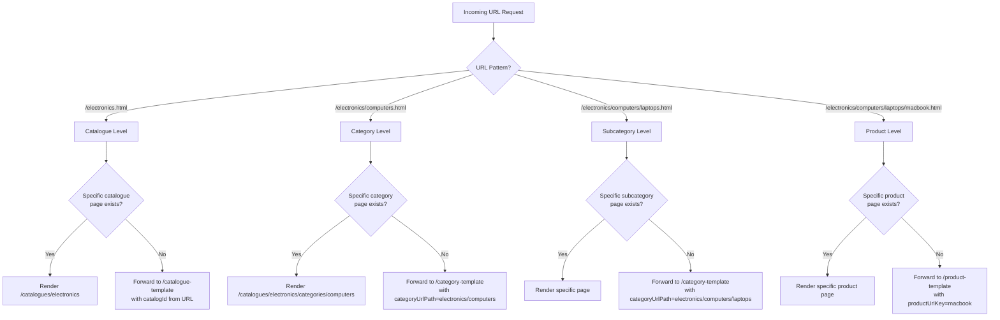

## Overview

This guide presents a cleaner and more scalable approach to AEM Commerce Integration Framework (CIF) implementations. Instead of creating pages for every product and category, you start with just **three base templates** and layer specific pages only where needed.

## Simplified Architecture

### 1. Base Template Structure

```
/content/mysite/en/
  ├── catalogue-template/              [Generic catalogue page]
  │   └── jcr:content
  │       ├── sling:resourceType = "mysite/components/commerce/cataloguepage"
  │       └── cq:template = "/conf/mysite/settings/wcm/templates/catalogue-page"
  │
  ├── category-template/               [Generic category page - handles both categories & subcategories]
  │   └── jcr:content
  │       ├── sling:resourceType = "mysite/components/commerce/categorypage"
  │       └── cq:template = "/conf/mysite/settings/wcm/templates/category-page"
  │
  ├── product-template/                [Generic product page]
  │   └── jcr:content
  │       ├── sling:resourceType = "mysite/components/commerce/productpage"
  │       └── cq:template = "/conf/mysite/settings/wcm/templates/product-page"
  │
  └── catalogues/                      [Container for specific pages ONLY]
      ├── electronics/                 [Specific catalogue page - optional]
      │   ├── jcr:content
      │   │   ├── cif:magentoRootCategoryIdentifier = "electronics"
      │   │   └── (authored banner, hero, etc.)
      │   │
      │   └── categories/
      │       ├── computers/           [Specific category page - optional]
      │       │   ├── jcr:content
      │       │   │   ├── cif:categoryUrlPath = "electronics/computers"
      │       │   │   ├── cif:includesSubcategories = true
      │       │   │   └── (authored content)
      │       │   │
      │       │   └── products/
      │       │       └── macbook-pro/ [Specific product page - optional]
      │       │           └── jcr:content
      │       │               ├── cif:productUrlKey = "macbook-pro"
      │       │               └── (authored content)
      │       │
      │       └── phones/              [Another specific category]
      │           └── jcr:content
      │
      └── fashion/                     [Another specific catalogue]
          └── ...
```

**Key Insight:** The `category-template` handles both category and subcategory requests. The commerce backend's category hierarchy determines the depth, not the AEM structure.

## Configuration

### 2. CIF Specific Page Strategy

```json
// com.adobe.cq.commerce.core.components.internal.services.SpecificPageStrategy.cfg.json
{
  "generateSpecificPageUrls": true
}
```

### 3. Site Structure Configuration

Configure your site structure to point to the three base templates:

```json
// com.adobe.cq.commerce.core.components.internal.services.sitemap.SitemapLinkExternalizerProvider-mysite.cfg.json
{
  "siteRootPath": "/content/mysite/en",
  "productPages": [
    "/content/mysite/en/product-template"
  ],
  "categoryPages": [
    "/content/mysite/en/category-template"
  ],
  "catalogPages": [
    "/content/mysite/en/catalogue-template"
  ]
}
```

### 4. Sling Resource Resolver Mapping

Simple path shortening only:

```json
// org.apache.sling.jcr.resource.internal.JcrResourceResolverFactoryImpl.cfg.json
{
  "resource.resolver.mapping": [
    "/content/mysite/en/catalogues/:/-/",
    "/content/mysite/en/:-/"
  ],
  "resource.resolver.map.location": "/etc/map"
}
```

Or via `/etc/map` (cleaner for multiple domains):

```
/etc/map/
  └── http/
      └── mysite.com/
          └── jcr:content
              ├── sling:internalRedirect = "/content/mysite/en"
              └── sling:match = "^http/mysite\\.com/"
```

### 5. URL Format Configuration

Configure CIF to use hierarchical URLs:

```json
// com.adobe.cq.commerce.core.components.internal.services.UrlProviderImpl-mysite.cfg.json
{
  "productUrlTemplate": "{{page}}/{{url_key}}.html",
  "categoryUrlTemplate": "{{page}}/{{url_path}}.html",
  "useUrlPath": true
}
```

## How URL Resolution Works

### URL Resolution Flow



### Example 1: All Generic

**URL:** `/electronics/computers/laptops/thinkpad-x1.html`

1. Sling resolves to `/content/mysite/en/electronics/computers/laptops/thinkpad-x1.html`
2. SpecificPageFilterFactory intercepts the request
3. Checks for specific pages:
   - `/content/mysite/en/catalogues/electronics` → Not found
   - `/content/mysite/en/catalogues/electronics/categories/computers` → Not found
   - `/content/mysite/en/catalogues/electronics/categories/computers/products/thinkpad-x1` → Not found
4. SpecificPageStrategy.getGenericPage() called:
   - Parses URL: `productUrlKey = "thinkpad-x1"`, `categoryUrlPath = "electronics/computers/laptops"`
   - Returns: `/content/mysite/en/product-template`
5. Request forwarded internally to `/content/mysite/en/product-template`
6. Product component reads productUrlKey from request and fetches data via GraphQL
7. **Result:** Generic product template renders with Thinkpad X1 data

### Example 2: Specific Catalogue, Generic Category

**URL:** `/electronics/tablets.html`

1. Sling resolves to `/content/mysite/en/electronics/tablets.html`
2. SpecificPageFilterFactory checks:
   - `/content/mysite/en/catalogues/electronics` → Found! (specific page exists)
   - But the request is for `/electronics/tablets`, not `/electronics`
   - Checks: `/content/mysite/en/catalogues/electronics/categories/tablets` → Not found
3. SpecificPageStrategy.getGenericPage() called:
   - Looks at `categoryUrlPath = "electronics/tablets"`
   - Checks if `/catalogues/electronics` is configured as a catalog root with `cif:magentoRootCategoryIdentifier = "electronics"`
   - Returns: `/content/mysite/en/category-template`
4. Request forwarded to category template
5. Category component fetches category data for "tablets" under "electronics"
6. **Result:** Generic category template renders tablets category

### Example 3: Specific Product Page

**URL:** `/electronics/computers/macbook-pro.html`

1. Sling resolves to `/content/mysite/en/electronics/computers/macbook-pro.html`
2. SpecificPageFilterFactory checks:
   - `/content/mysite/en/catalogues/electronics/categories/computers/products/macbook-pro` → Found!
3. SpecificPageStrategy.isSpecificPageFor() validates:
   - Page has `cif:productUrlKey = "macbook-pro"` ✓
   - URL path contains productUrlKey ✓
   - Match confirmed!
4. Request uses specific page directly (no forwarding needed)
5. **Result:** Specific product page with authored content renders

## Page Property Configuration

### Generic Templates (Base Configuration)

#### catalogue-template/jcr:content

```xml
<jcr:content
    jcr:primaryType="cq:PageContent"
    sling:resourceType="mysite/components/commerce/cataloguepage"
    cq:template="/conf/mysite/settings/wcm/templates/catalogue-page">
    
    <!-- Generic components that read catalogId from URL -->
    <root>
        <cataloghero
            sling:resourceType="mysite/components/commerce/cataloghero"/>
        <cataloggrid
            sling:resourceType="mysite/components/commerce/cataloggrid"/>
    </root>
</jcr:content>
```

#### category-template/jcr:content

```xml
<jcr:content
    jcr:primaryType="cq:PageContent"
    sling:resourceType="mysite/components/commerce/categorypage"
    cq:template="/conf/mysite/settings/wcm/templates/category-page">
    
    <!-- Generic components that read categoryUrlPath from URL -->
    <root>
        <categoryheader
            sling:resourceType="mysite/components/commerce/categoryheader"/>
        <productlist
            sling:resourceType="mysite/components/commerce/productlist"
            pageSize="{Long}24"/>
        <facets
            sling:resourceType="mysite/components/commerce/facets"/>
    </root>
</jcr:content>
```

#### product-template/jcr:content

```xml
<jcr:content
    jcr:primaryType="cq:PageContent"
    sling:resourceType="mysite/components/commerce/productpage"
    cq:template="/conf/mysite/settings/wcm/templates/product-page">
    
    <!-- Generic components that read productUrlKey from URL -->
    <root>
        <productdetail
            sling:resourceType="mysite/components/commerce/productdetail"/>
        <recommendations
            sling:resourceType="mysite/components/commerce/recommendations"/>
    </root>
</jcr:content>
```

### Specific Pages (When Authored)

#### Specific Catalogue: catalogues/electronics/jcr:content

```xml
<jcr:content
    jcr:primaryType="cq:PageContent"
    sling:resourceType="mysite/components/commerce/cataloguepage"
    cq:template="/conf/mysite/settings/wcm/templates/catalogue-page"
    cif:magentoRootCategoryIdentifier="electronics"
    cif:magentoRootCategoryIdentifierType="urlPath">
    
    <!-- Authored content that overrides/extends generic template -->
    <root>
        <heroimage
            jcr:primaryType="nt:unstructured"
            sling:resourceType="wcm/foundation/components/image"
            fileReference="/content/dam/mysite/electronics-hero.jpg"/>
        <campaignbanner
            sling:resourceType="mysite/components/content/banner"
            text="Holiday Sale - 20% Off All Electronics!"/>
        
        <!-- Can still include generic components -->
        <cataloggrid
            sling:resourceType="mysite/components/commerce/cataloggrid"/>
    </root>
</jcr:content>
```

#### Specific Category: catalogues/electronics/categories/computers/jcr:content

```xml
<jcr:content
    jcr:primaryType="cq:PageContent"
    sling:resourceType="mysite/components/commerce/categorypage"
    cif:categoryUrlPath="electronics/computers"
    cif:categoryUrlKey="computers"
    cif:includesSubcategories="{Boolean}true"
    cif:useForCategories="[electronics/computers]">
    
    <!-- Specific authored content -->
    <root>
        <buyingguide
            sling:resourceType="mysite/components/content/richtext"
            text="&lt;h2&gt;Computer Buying Guide&lt;/h2&gt;&lt;p&gt;...&lt;/p&gt;"/>
        
        <!-- Inherit generic product list component -->
        <productlist
            sling:resourceType="mysite/components/commerce/productlist"
            pageSize="{Long}36"/>
    </root>
</jcr:content>
```

#### Specific Product: catalogues/electronics/categories/computers/products/macbook-pro/jcr:content

```xml
<jcr:content
    jcr:primaryType="cq:PageContent"
    sling:resourceType="mysite/components/commerce/productpage"
    cif:productUrlKey="macbook-pro"
    cif:productSku="MACBOOK-PRO-16-2024"
    cif:selectorFilter="[macbook-pro, MACBOOK-PRO-16-2024]"
    cif:useForCategories="[electronics/computers]">
    
    <!-- Product-specific authored content -->
    <root>
        <productdetail
            sling:resourceType="mysite/components/commerce/productdetail"/>
        
        <editorialcontent
            sling:resourceType="mysite/components/content/container">
            <videoreviews/>
            <expertopinion/>
            <comparisonguide/>
        </editorialcontent>
        
        <recommendations
            sling:resourceType="mysite/components/commerce/recommendations"
            recommendationType="editorial"
            productSkus="[ipad-pro, airpods-max]"/>
    </root>
</jcr:content>
```

## Component Implementation

### Category Component (Handles Categories AND Subcategories)

```java
@Model(
    adaptables = SlingHttpServletRequest.class,
    adapters = {Category.class, ComponentExporter.class},
    resourceType = CategoryImpl.RESOURCE_TYPE
)
public class CategoryImpl implements Category {
    
    protected static final String RESOURCE_TYPE = "mysite/components/commerce/categorypage";
    
    @Self
    private SlingHttpServletRequest request;
    
    @OSGiService
    private UrlProvider urlProvider;
    
    @OSGiService
    private MagentoGraphqlClient magentoClient;
    
    private CategoryInterface categoryData;
    private String categoryUrlPath;
    private int depth;
    
    @PostConstruct
    protected void initModel() {
        // Parse category information from URL
        CategoryUrlFormat.Params params = urlProvider.parseCategoryUrlFormatParameters(request);
        
        if (params != null) {
            this.categoryUrlPath = params.getUrlPath();
            
            // Calculate depth from URL path
            this.depth = StringUtils.countMatches(categoryUrlPath, "/") + 1;
            
            // Fetch category data from commerce backend
            fetchCategoryData(params);
        }
    }
    
    private void fetchCategoryData(CategoryUrlFormat.Params params) {
        String query = """
            {
              categoryList(filters: {url_path: {eq: "%s"}}) {
                uid
                name
                url_path
                url_key
                description
                image
                product_count
                meta_title
                meta_description
                children {
                  uid
                  name
                  url_path
                  product_count
                }
                breadcrumbs {
                  category_name
                  category_url_path
                }
              }
            }
            """.formatted(categoryUrlPath);
        
        // Execute GraphQL query
        this.categoryData = magentoClient.execute(query).getCategoryList().get(0);
    }
    
    @Override
    public String getName() {
        return categoryData != null ? categoryData.getName() : null;
    }
    
    @Override
    public String getUrlPath() {
        return categoryUrlPath;
    }
    
    @Override
    public int getDepth() {
        return depth;
    }
    
    @Override
    public boolean isSubcategory() {
        return depth > 1;
    }
    
    @Override
    public List<CategoryInterface> getSubcategories() {
        return categoryData != null ? categoryData.getChildren() : Collections.emptyList();
    }
}
```

### Product Component

```java
@Model(
    adaptables = SlingHttpServletRequest.class,
    adapters = {Product.class, ComponentExporter.class},
    resourceType = ProductImpl.RESOURCE_TYPE
)
public class ProductImpl implements Product {
    
    protected static final String RESOURCE_TYPE = "mysite/components/commerce/productpage";
    
    @Self
    private SlingHttpServletRequest request;
    
    @OSGiService
    private UrlProvider urlProvider;
    
    @OSGiService
    private MagentoGraphqlClient magentoClient;
    
    private ProductInterface productData;
    private String productUrlKey;
    private String productSku;
    private String categoryUrlPath;
    
    @PostConstruct
    protected void initModel() {
        // Parse product information from URL
        ProductUrlFormat.Params params = urlProvider.parseProductUrlFormatParameters(request);
        
        if (params != null) {
            this.productUrlKey = params.getUrlKey();
            this.productSku = params.getSku();
            
            // Also capture category context if present
            CategoryUrlFormat.Params categoryParams = params.getCategoryUrlParams();
            if (categoryParams != null) {
                this.categoryUrlPath = categoryParams.getUrlPath();
            }
            
            // Fetch product data
            fetchProductData(params);
        }
    }
    
    private void fetchProductData(ProductUrlFormat.Params params) {
        String query = """
            {
              products(filter: {url_key: {eq: "%s"}}) {
                items {
                  uid
                  sku
                  name
                  url_key
                  price_range {
                    minimum_price {
                      final_price {
                        value
                        currency
                      }
                    }
                  }
                  image {
                    url
                    label
                  }
                  description {
                    html
                  }
                  categories {
                    uid
                    name
                    url_path
                  }
                }
              }
            }
            """.formatted(productUrlKey);
        
        GraphqlResponse<Products> response = magentoClient.execute(query);
        this.productData = response.getData().getProducts().getItems().get(0);
    }
    
    @Override
    public String getName() {
        return productData != null ? productData.getName() : null;
    }
    
    @Override
    public String getSku() {
        return productSku;
    }
    
    @Override
    public String getUrlKey() {
        return productUrlKey;
    }
}
```

## URL Examples and Resolution

| User URL | Specific Page Exists? | Resolves To | Rendered By |
|----------|----------------------|-------------|-------------|
| `/electronics.html` | ✅ Yes | `/catalogues/electronics` | Specific catalogue page with authored hero banner |
| `/fashion.html` | ❌ No | `/catalogue-template` | Generic catalogue template fetches "fashion" data |
| `/electronics/computers.html` | ✅ Yes | `/catalogues/electronics/categories/computers` | Specific category page with buying guide |
| `/electronics/tablets.html` | ❌ No | `/category-template` | Generic category template fetches "tablets" data |
| `/electronics/computers/laptops.html` | ❌ No | `/category-template` | Generic category template (subcategory) |
| `/electronics/computers/macbook-pro.html` | ✅ Yes | `/catalogues/.../products/macbook-pro` | Specific product page with editorial content |
| `/electronics/computers/generic-mouse.html` | ❌ No | `/product-template` | Generic product template fetches mouse data |

## Key Properties Reference

| Property | Purpose | Used On | Required? |
|----------|---------|---------|-----------|
| `cif:magentoRootCategoryIdentifier` | Links page to commerce catalogue root | Specific catalogue pages | ✅ |
| `cif:magentoRootCategoryIdentifierType` | Type of identifier (usually "urlPath") | Specific catalogue pages | ✅ |
| `cif:categoryUrlPath` | Full category path from root | Specific category pages | ✅ |
| `cif:categoryUrlKey` | Category URL segment | Specific category pages | Recommended |
| `cif:includesSubcategories` | Page handles child categories too | Specific category pages | Optional |
| `cif:useForCategories` | Category paths this page applies to | Specific category/product pages | ✅ |
| `cif:productUrlKey` | Product identifier in URL | Specific product pages | ✅ |
| `cif:productSku` | Product SKU | Specific product pages | Recommended |
| `cif:selectorFilter` | Multi-value product identifiers | Specific product pages | ✅ |

## Advantages of This Approach

### 1. Minimal Maintenance
- Only 3 template pages to maintain globally
- Create specific pages only for high-value content
- No deep folder structures unless needed

### 2. Scalability
- Handle unlimited products with zero additional pages
- Commerce catalogue structure drives URL hierarchy
- No AEM page creation bottleneck

### 3. Flexibility
- Start 100% generic, add specific pages incrementally
- Mix generic and specific pages at any level
- Easy to promote generic → specific when needed

### 4. Performance
- Minimal JCR queries (only 3 potential template lookups)
- Efficient dispatcher caching (few unique pages)
- Fast page resolution through SpecificPageFilterFactory

### 5. SEO-Friendly
- Clean hierarchical URLs reflect commerce structure
- Specific pages allow unique meta tags and content
- Generic pages still support dynamic meta from commerce data

## Testing Checklist

### Template Resolution
- ☑ `/random-catalogue.html` → Falls back to `/catalogue-template`
- ☑ `/electronics.html` → Uses `/catalogues/electronics` if it exists
- ☑ `/electronics/random-category.html` → Falls back to `/category-template`
- ☑ `/electronics/computers.html` → Uses specific page if it exists

### Category vs Subcategory Handling
- ☑ `/electronics/computers.html` (depth=1) → category-template with depth=1
- ☑ `/electronics/computers/laptops.html` (depth=2) → category-template with depth=2
- ☑ `/electronics/computers/laptops/gaming.html` (depth=3) → category-template with depth=3
- ☑ All depths render correctly with same template

### Product Resolution
- ☑ `/electronics/computers/macbook-pro.html` → Specific product page if exists
- ☑ `/electronics/computers/random-product.html` → Generic product-template
- ☑ Product component correctly extracts productUrlKey from all URLs

### Specific Page Matching
- ☑ Page with `cif:categoryUrlPath="electronics/computers"` matches `/electronics/computers.html`
- ☑ Page with `cif:includesSubcategories=true` matches `/electronics/computers/laptops.html`
- ☑ Page with `cif:productUrlKey="macbook-pro"` matches only exact SKU

## Conclusion

This simplified architecture gives you:

✅ Three base templates handle the entire catalogue  
✅ Category-template intelligently handles both categories and subcategories based on URL depth  
✅ Specific pages only where you need custom authored content  
✅ Clean URLs that reflect your commerce hierarchy  
✅ Zero maintenance for most of your catalogue  
✅ Full flexibility to add specific pages at any level, any time

The magic is in letting CIF's dynamic routing and your commerce backend's category structure drive the URL hierarchy, while AEM provides the rendering layer with minimal page creation overhead.

---

**Tags:** #AEM #CIF #Commerce #Architecture #Sling #URLRouting #Scalability

**Last Updated:** December 9, 2025